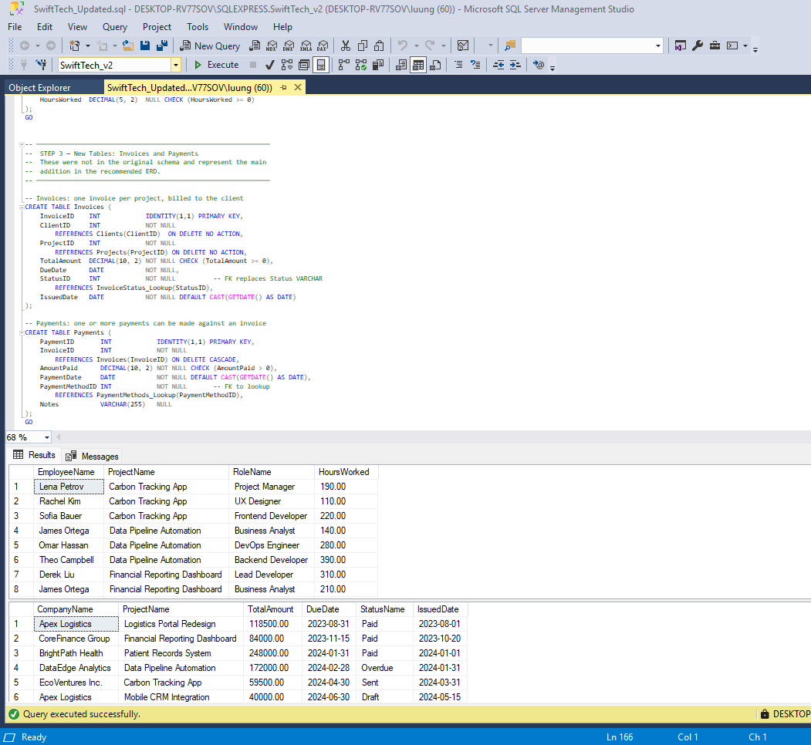
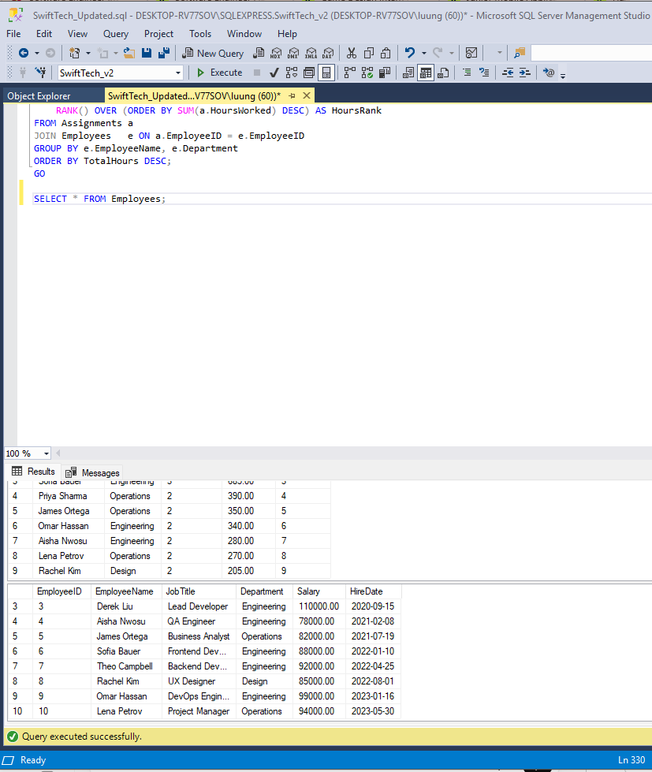
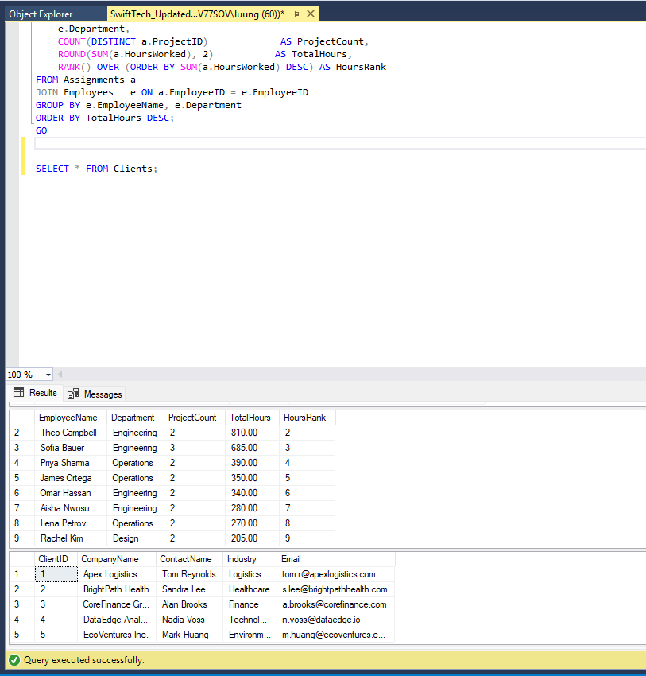
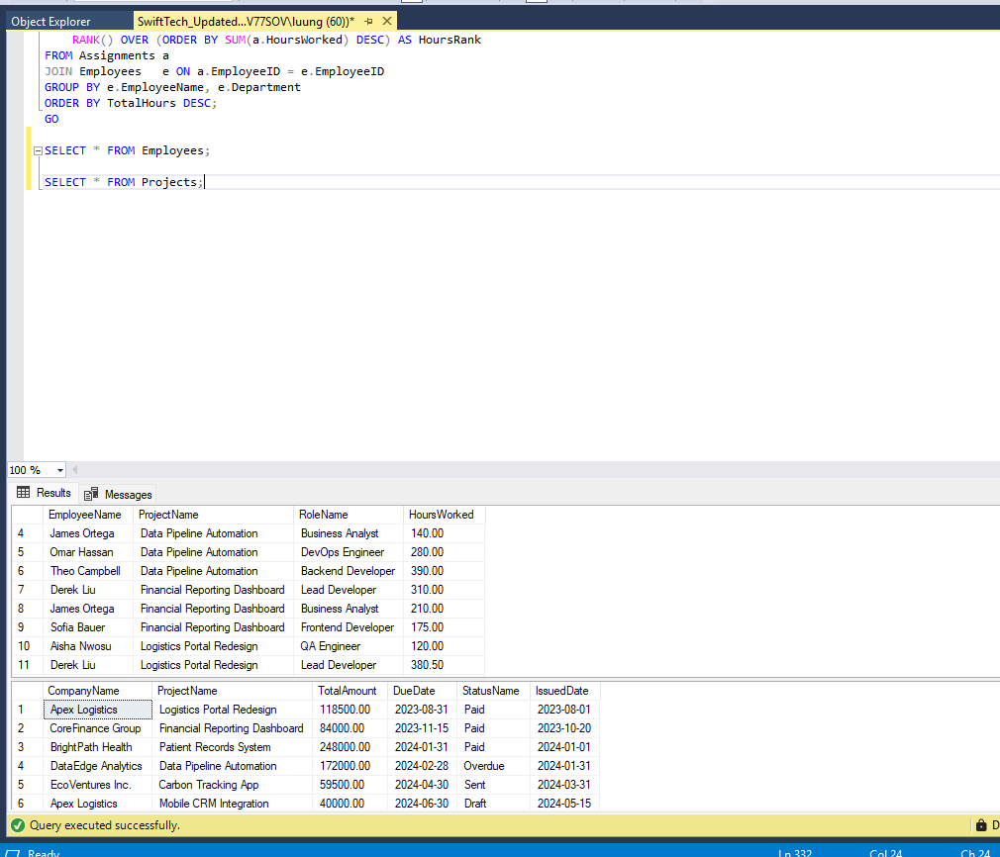

# SwiftTech Solutions Database

## Overview

SwiftTech Solutions Database is a relational SQL Server database designed to manage employees, clients, projects, assignments, invoices, and payments for a software consulting company.

This project demonstrates database design, normalization, schema migration, foreign key relationships, and SQL Server scripting.

---

## Features

- Employee Management
- Client Management
- Project Tracking
- Employee Assignments
- Invoice Management
- Payment Tracking
- Lookup Tables
- Database Migration Script

---

## Technologies

- Microsoft SQL Server
- T-SQL
- SQL Server Management Studio (SSMS)

---

The database consists of the following tables:

- Employees
- Clients
- Projects
- Assignments
- Invoices
- Payments
- Roles_Lookup
- InvoiceStatus_Lookup
- PaymentMethods_Lookup

## Database Tables

- Employees
- Clients
- Projects
- Assignments
- Invoices
- Payments
- Roles_Lookup
- InvoiceStatus_Lookup
- PaymentMethods_Lookup

---

## Files

database/

- SwiftTech_Updated.sql
- SwiftTech_Migration.sql

---

## Skills Demonstrated

- Database Design
- Data Modeling
- Normalization
- Foreign Keys
- Constraints
- Identity Columns
- Lookup Tables
- Database Migration
- T-SQL

---
# Screenshots

## Database Structure

The SwiftTech_v2 database contains normalized tables for employees, projects, clients, invoices, and payments.

---

## Database Tables

Object Explorer showing all database tables and lookup tables created in SQL Server.

---

## Employees Table

Sample employee records used for project assignments.

---

## Clients Table

Client information used for project and invoice management.

---

## Projects Table

Project records demonstrating relationships between employees and clients.

## Author

Luu Nguyen
